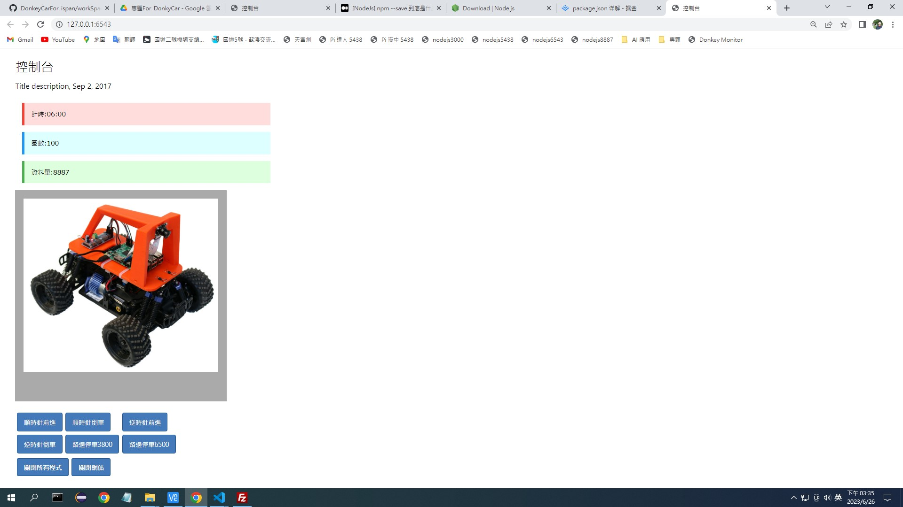

# 預先操作
請先進到這個資料夾
```shell
cd web_car_DaRen
```

下載並安裝好 LTS 版的 [nodejs](https://nodejs.org/en/download)

載入套件，因為我把所需的套件都寫進 `package.json`，只執行這一句就好
```shell
npm install
```

# Run
- `node index.js`

# edit
- index.js 網站總管
- www/json/autoModel.json 模型名稱放這
- views/index.ejs 控制台主頁

# 介紹

