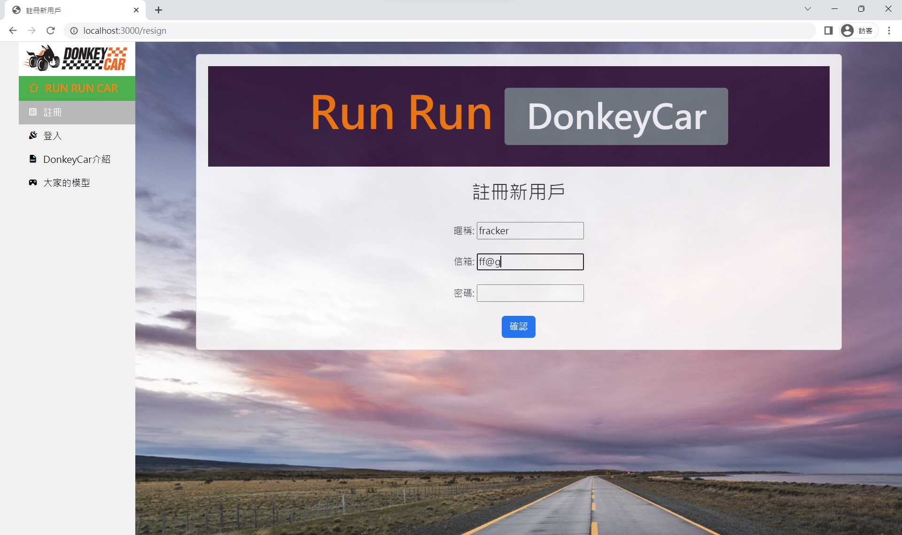
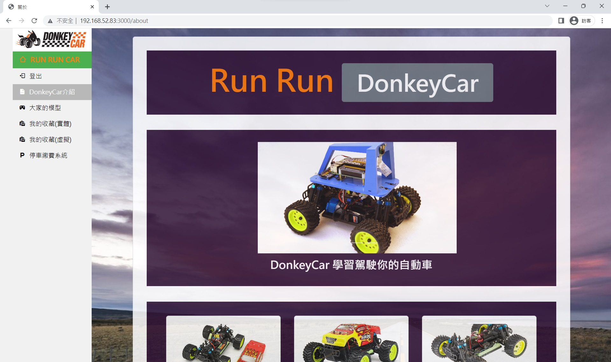

# Run
1. node ejs00.js
2. open welcome.html

# edit
views/control.ejs 控制台主頁

# models
npm install express --save
npm install body-parser --save
npm install cookie-parser --save
npm install ejs --save
npm install ejs-locals --save
 
# 介紹

<!--  -->
