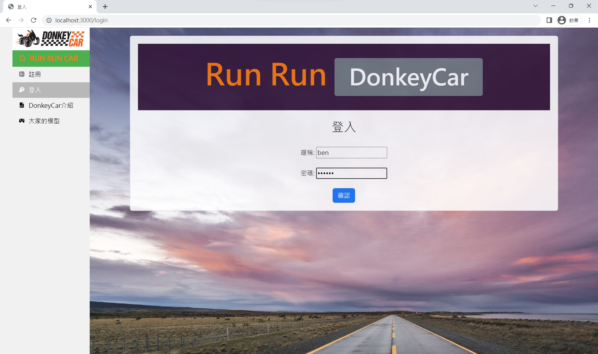

# 預先操作
請先進到這個資料夾
```shell
cd workSpace_donkey_web
```

下載並安裝好 LTS 版的 [nodejs](https://nodejs.org/en/download)

載入套件，因為我把所需的套件都寫進 `package.json`，只執行這一句就好
```shell
npm install
```

# Run
我用了 `commander.js` 寫了系統參數處理，用來決定 Rpi 的控制網頁位址:
- `node ejs00.js`
- `node ejs00.js -h` 或是 `node ejs00.js --help` : 幫助
- 參數 `-w`, `--web` 可以選擇電腦主機所處的位置，預設是 `0`
  - `0`, `302`, `f3`, `c302` 指向 302 wifi DaRen Rpi
    - `node ejs00.js -w 302`
    - `node ejs00.js -w f3`
    - `node ejs00.js -w c302`
  - `1`, `f15` 指向 15 樓 huYen 手機熱點 DaRen Rpi
    - `node ejs00.js -w f15`
- 參數 `--set-host` 可以直接設定 host，會自動在 host 前後補充 `http://`, `:6543/` 形成 Rpi 的 模型控制網頁網址、補充 `http://`, `:8887/drive` 形成 Rpi 的 Donkeycar 網頁網址
  - `node ejs00.js --set-host 127.20.18.5`
- 參數 `-t`, `--set-ctrWeb` 可以直些設定 Rpi 的 模型控制網頁網址
  - `node ejs00.js -t http://192.168.52.143:6543/`
  - `node ejs00.js --set-ctrWeb http://192.168.52.143:6543/`
- 參數 `-c`, `--set-carWeb` 可以直些設定 Rpi 的 Donkeycar 網頁網址
  - `node ejs00.js -c http://192.168.52.143:8887/drive`
  - `node ejs00.js --set-carWeb http://192.168.52.143:8887/drive`

# edit
- ejs00.js 網站總管
- views/layout.js 所有網頁共通框架
- views/control.ejs 控制台主頁(只有框架)

# 網頁介紹
## 首頁

## 登入頁

## 註冊頁

## 介紹頁

## 模型控制頁

