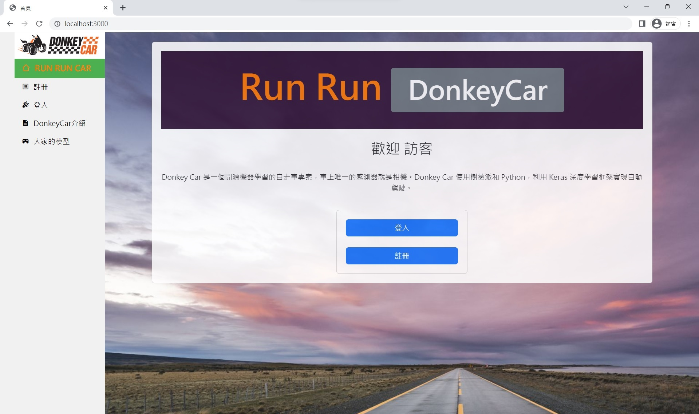

# 預先操作
請先進到這個資料夾
```shell
cd workSpace_donkey_web
```

下載並安裝好 LTS 版的 [nodejs](https://nodejs.org/en/download)

載入套件，因為我把所需的套件都寫進 `package.json`，只執行這一句就好
```shell
npm install
```

# Run
我用了 `commander.js` 寫了系統參數處理，用來決定 Rpi 的控制網頁位址:
- `node src/server.js`
- `node src/server.js -h` 或是 `node src/server.js --help` : 幫助
- 參數 `-w`, `--web` 可以選擇電腦主機所處的位置，預設是 `0`
  - `0`, `302`, `f3`, `c302` 指向 302 wifi
    - `node src/server.js -w 302`
    - `node src/server.js -w f3`
    - `node src/server.js -w c302`
  - `1`, `f15` 指向 15 樓 huYen 手機熱點
    - `node src/server.js -w f15`
- 參數 `-u`, `--user` 可以選擇電腦主機的擁有人，預設是 `Jack`(吳漢中)
  - `Jack`, `jack`, `HanChung` 指吳漢中
    - `node src/server.js -u jack`
    - `node src/server.js -w f15 -u jack` 參數可以混用
  - `Ben`, `ben`, `HuYen` 指呂沍諺
  - `Jason`, `jason`, `DaRen` 指吳達人
- 參數 `-d`, `--desktop` 指電腦是否使用桌電，不寫代表預設的筆電
  - `node src/server.js -d` 使用桌電
  - `node src/server.js` 使用筆電
- 參數 `-i`, `--set-comHost` 可以設定電腦主機 IP
  - `node src/server.js --set-comHost 127.20.18.5`
  - `node src/server.js -i 192.168.32.50`
- 參數 `-r`, `--set-rpiHost` 可以設定樹梅Pi(自駕車) IP
  - `node src/server.js --set-rpiHost 192.168.52.143`
  - `node src/server.js -r 192.168.52.143`
- 參數 `-c`, `--set-comPort` 可以設定主網頁的 port
  - `node src/server.js -c 3000`
  - `node src/server.js -c 8080`
- 參數 `-o`, `--set-ownPort` 可以設定用戶個人網頁的 port
  - `node src/server.js -o 6543`
  - `node src/server.js -o 3456`
- 參數 `-k`, `--set-carPort` 可以設定 donkey car "/drive" 的 port
  - `node src/server.js -k 8887`
- 參數 `-s`, `--use-self` 可以設定使用自訂的 IP, port 設置，具體看 [自訂 IP, port 設置](#用-npm-run-setnet)

## 用 `npm start`
我有設定 package.json，可以用 `npm start` 命令 取代 `node src/server.js` 命令；若需要帶參數，可以用 `npm start --` 取代上面的 `node src/server.js` 部分，後面使用相同參數。

## 用 `npm run setNet`
在本資料夾先執行 `npm run setNet` 用來進行自訂 IP, port 設置。設置完成後會取得 `key`，之後以 `node src/server.js -s 'key'` 或 `npm start -- -s 'key'` 執行自訂設置。

# edit
- src/server.js 網站總管
- src/views/layout.js 所有網頁共通框架
- src/views/control.ejs 控制台主頁(只有框架)

# 網頁介紹
## 首頁

## 登入頁

## 註冊頁

## 介紹頁

## 模型控制頁

